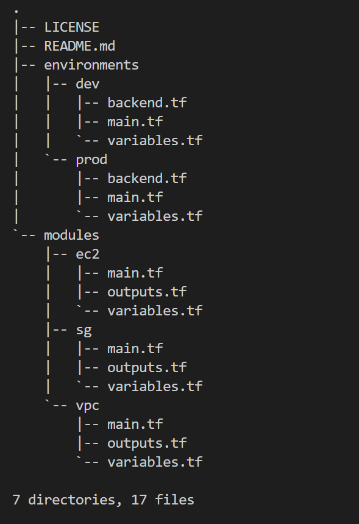

# Terraform Infrastructure as Code (IaC)

### This repository contains Terraform code to provision and manage infrastructure components using the Infrastructure as Code (IaC) approach.

# Structure

- `environments:` This directory contains environment-specific configurations. Each environment (e.g., dev and prod) has its own set of Terraform files, including main.tf for defining resources, variables.tf for input variables, and backend.tf for backend configuration.

- `modules:` This directory holds reusable modules that can be used across different environments. Each module (ec2, sg, and vpc) has its own set of Terraform files, including main.tf for defining module resources, variables.tf for input variables, and outputs.tf for module outputs.

## Getting Started

To use this project:

1. Clone this repository to your local machine.
2. Navigate to the desired environment directory (e.g., `environments/dev` or `environments/prod`).
3. Review and customize the configuration files as needed.
4. Run `terraform init` to initialize the Terraform workspace.
5. Run `terraform plan` to see the execution plan.
6. Run `terraform apply` to apply the changes and provision the infrastructure.

## License

This repository is licensed under the [MIT License](LICENSE).
